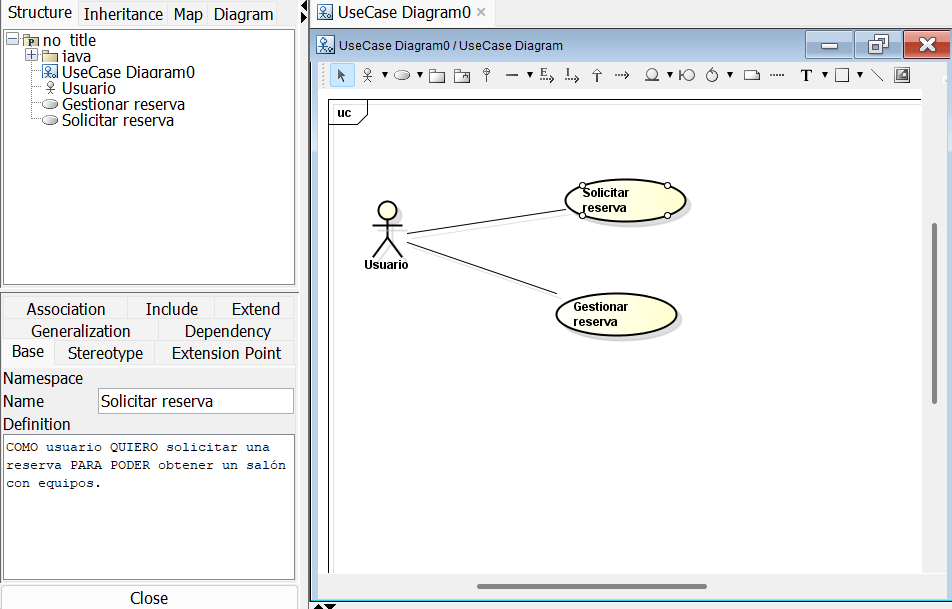
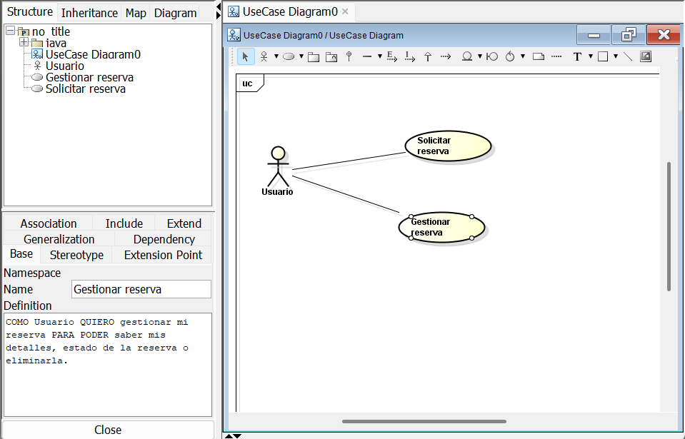

# 📄 Requerimientos del Sistema

## 1. Lista general de requerimientos

El sistema de SilabInfo tiene los siguientes requerimientos (descripción a alto nivel):

### 1.1 Requerimientos funcionales

El sistema de Silabinfo debe tener la capacidad de:

1. Validar solicitudes de reserva.
2. Gestionar el estado de una solicitud.
3. Validar reglas por tipo de recurso.

## 2. Diagramas de caso de uso

### 2.1 Requerimiento Funcional 1

| Campo | Descripción |
|------|-------------|
| **ID** | RF-01 |
| **Nombre del requerimiento** | VALIDACIÓN SOLICITUDES DE RESERVA|
| **Descripción** | *El sistema debe validar las solicitudes de reserva debe ser creada por el usuario (El usuario especifica la solicitud)*|
| **Precondiciones** | *Para que el sistema cumpla con este requirimiento debe tener previamente los datos de los recursos de la ECI* |
| **Actor** | *Usuario* |
| **Flujo principal** | 1. El actor solicita una reserva … 2. El sistema aprueba (validando primero) la reserva … 3. El sistema retorna una reserva en exito o en falla |
| **Diagrama de caso de uso** | |
| **Poscondiciones** | *La creacion de la reserva (en caso de exito) o un mensaje de error en caso de falla* |

### 2.2 Requerimiento Funcional 2

| Campo | Descripción |
|------|-------------|
| **ID** | RF-02 |
| **Nombre del requerimiento** | GESTIONAR SOLICITUD |
| **Descripción** | *El sistema debe permitir la validación de una solicitud/reserva para la otbención del estado de la misma o su respectiva eliminación* |
| **Precondiciones** | *Para que el sistema cumpla con este requerimiento, Silabinfo debe tener previamente una reserva creada* |
| **Actor** | *El sistema como tal o un admin* |
| **Flujo principal** | 1. El admin desea gestionar las reservas 2. El sistema compara informacion  3. El sistema realiza la acción deseada de eliminar una reserva ya realizada |
| **Diagrama de caso de uso** | |
| **Poscondiciones** | *Se espera como resultado que el sistema arroje la info solicitada y lsa acciones hechas.* |

