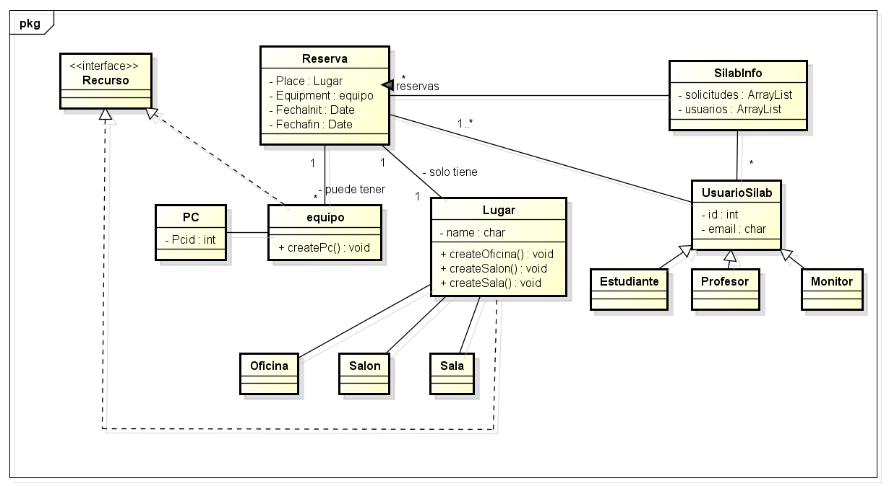

# DOSW_ParcialT1_JuanVega
Parcial DOSW T1 Juan Pablo Vega Villamil 2026-1
--
1. IMAGEN MIRO
   
  
Entiendase como recursos de la eci todos los tipos de sala y equipos asociados (Los cuales no puse para la brevedad y rapidez)  
considerese también dentro de este campo: Silabinfo tiene la información de los computadores del B0. De cada
computador tiene: id y número.
Silabinfo tiene la información de las oficinas, salones de clase y salas de
estudio. De los 3 tipos de recursos, almacena: id, nombre, ocupado?  

2. Patrones
   En esta seccion identifiqué 2 patrones de uso para usar:
   - ABSTRACT FACTORY - Creacional : Debido a como está estructurado el sistema en general ( sea por docentes estudiantes, las reglas que tienen las salas, el tipo de salas) son varios parametros a analizar
  
   - ADAPTER - Estructural: Se decide que adapter debido a las reglas e importaciones de 2 sistemas diferentes para los datos (Enlace y RH)

3. SECCION DE REQUERIMIENTOS FUNCIONALES Y NO FUNCIONALES
   -  FUNCIONALES:
     
        a) El sistema debe validar solicitudes de reserva.  
      
        b) El sistema debe permitir gestionar el estado de una solicitud.
   
        c) El sistema debe validar las reglas por tipo de recurso.

   -    NO FUNCIONALES
        a) Están descritos como: Para los administradores de Silabinfo es importante que se mantengan los colores alusivos al programa de
Ingeniería de Sistemas. Igualmente, debe ser responsive y tener una tipología legible.

4. SECCION DE DIAGRAMAS DE CASOS DE USO
   En esta seccion se seleccionan los dos requerimientos funcionales más importantes: Validar solicitud reserva y permitir gestión estado solicitud por parte de el sistema Silab(la gestion).
   
| Caso de uso 1 | Caso de uso 2 |
| :---: | :---: |
|  |  |

6. TAREAS

ÉPICA:  VALIDAR SOLICITUDES DE RESERVA  

| Campo | Descripción |
|------|-------------|
| **ID** | HU-01 |
| **Título** |Creacion solicitud|
| **Descripción** | Como usuario quiero crear una solicitud para poder realizar mi reserva.|
| **Prioridad** | *Alta* |
| **Justificación** | Esta es una solicitud de nivel alto ya que es en lo que se centra el sistema base, es lo que hace el sistema como tal, por ende al ser un nucleo principal, su prioridad de finalización de dicho sistema es alta. |
| **Estimación** | 8 |

| Campo | Descripción |
|------|-------------|
| **ID** | TR-01 |
| **Título** | Especificación correo  |
| **ID de la Historia de Uso asociada** | HU-01 |
| **Descripción** | Desarrollar receptor de data de los correos para validar que el correoingresado si sea valido y exista |

| Campo | Descripción |
|------|-------------|
| **ID** | TR-02 |
| **Título** | Especificación salon|
| **ID de la Historia de Uso asociada** | HU-01 |
| **Descripción** | Desarrollar una funcion que permita la especificación de los recursos solicitados y la validacion del mismo|
|

| Campo | Descripción |
|------|-------------|
| **ID** | TR-03 |
| **Título** | creacion solicitud|
| **ID de la Historia de Uso asociada** | HU-01 |
| **Descripción** | Crear una funcion que permita la creacion de la solicitud de la reserva luego de ser validada bajo los parametros previos ingresados (email, recursos) |

7. DIAGRAMA UML
   

   Estoyy aplicando OPEN/ClOSED debido a que extiendo las clases , Interface Segregation al utilizar la interfaz para tener funcionalidades.

   Así mismo Liskov principle al permitir que las clases hijas apliquen el comportamiento de los padres y no lo rompan.
   

