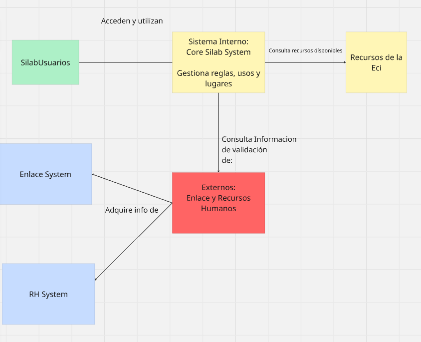

# DOSW_ParcialT1_JuanVega
Parcial DOSW T1 Juan Pablo Vega Villamil 2026-1
--
1. IMAGEN MIRO
   
  
Entiendase como recursos de la eci todos los tipos de sala y equipos asociados (Los cuales no puse para la brevedad y rapidez)  
considerese también dentro de este campo: Silabinfo tiene la información de los computadores del B0. De cada
computador tiene: id y número.
Silabinfo tiene la información de las oficinas, salones de clase y salas de
estudio. De los 3 tipos de recursos, almacena: id, nombre, ocupado?  

2. Patrones
   En esta seccion identifiqué 2 patrones de uso para usar:
   - ABSTRACT FACTORY - Creacional : Debido a como está estructurado el sistema en general ( sea por docentes estudiantes, las reglas que tienen las salas, el tipo de salas) son varios parametros a analizar
  
   - ADAPTER - Estructural: Se decide que adapter debido a las reglas e importaciones de 2 sistemas diferentes para los datos (Enlace y RH)

3. SECCION DE REQUERIMIENTOS FUNCIONALES Y NO FUNCIONALES
   -  FUNCIONALES:
     
        a) El sistema debe validar solicitudes de reserva.  
      
        b) El sistema debe permitir gestionar el estado de una solicitud.
   
        c) El sistema debe validar las reglas por tipo de recurso.

   -    NO FUNCIONALES
        a) Están descritos como: Para los administradores de Silabinfo es importante que se mantengan los colores alusivos al programa de
Ingeniería de Sistemas. Igualmente, debe ser responsive y tener una tipología legible.

4. SECCION DE DIAGRAMAS DE CASOS DE USO
   En esta seccion se seleccionan los dos requerimientos funcionales más importantes: Validar solicitud reserva y permitir gestión estado solicitud.

